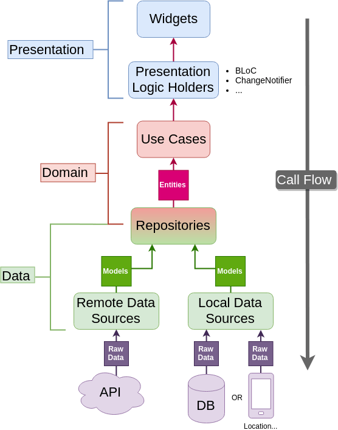

# number_trivia

#### *project structure*
> here's general picture of clean flutter architecture



```
persentation is comprised of widgets in this case
like number trivia page and logic holders some state
managment in this case i intend to use bloc
```

```
this layer should be indpendent on any othe layer
it will contain the core buisness logic which will
be excuted inside usecases and also buisness objects
aka entity
```